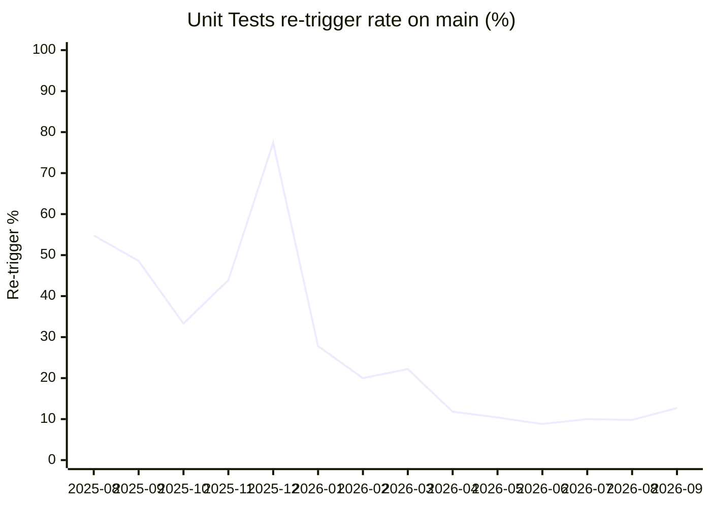

# Unit Tests — monthly re-trigger rate (main)

How often the [`Unit Tests`](../../actions/workflows/unit_tests.yml) workflow on `main`
was **re-triggered** to green, as a percentage of runs per month.

A run counts when its final `run_attempt >= 2` **and** it eventually succeeded — a proxy
for flakiness. Re-runs that still failed are real failures and are excluded.

> Auto-generated by `.github/workflows/unit_test_flakiness_report.yml`. Each run upserts
> the months still in the API into `data/retrigger_rate.csv`, preserving history past
> GitHub's ~400-day run retention. Do not edit this branch by hand.

## Data

| Month | Runs | Re-triggered | Re-trigger % |
|-------|-----:|-------------:|-------------:|
| 2025-08 | 31 | 17 | 54.8% |
| 2025-09 | 35 | 17 | 48.6% |
| 2025-10 | 36 | 12 | 33.3% |
| 2025-11 | 41 | 18 | 43.9% |
| 2025-12 | 31 | 24 | 77.4% |
| 2026-01 | 79 | 22 | 27.8% |
| 2026-02 | 60 | 12 | 20% |
| 2026-03 | 72 | 16 | 22.2% |
| 2026-04 | 76 | 9 | 11.8% |
| 2026-05 | 48 | 5 | 10.4% |
| 2026-06 | 68 | 6 | 8.8% |
| 2026-07 | 60 | 6 | 10% |
| 2026-08 | 51 | 5 | 9.8% |
| 2026-09 | 55 | 7 | 12.7% |
