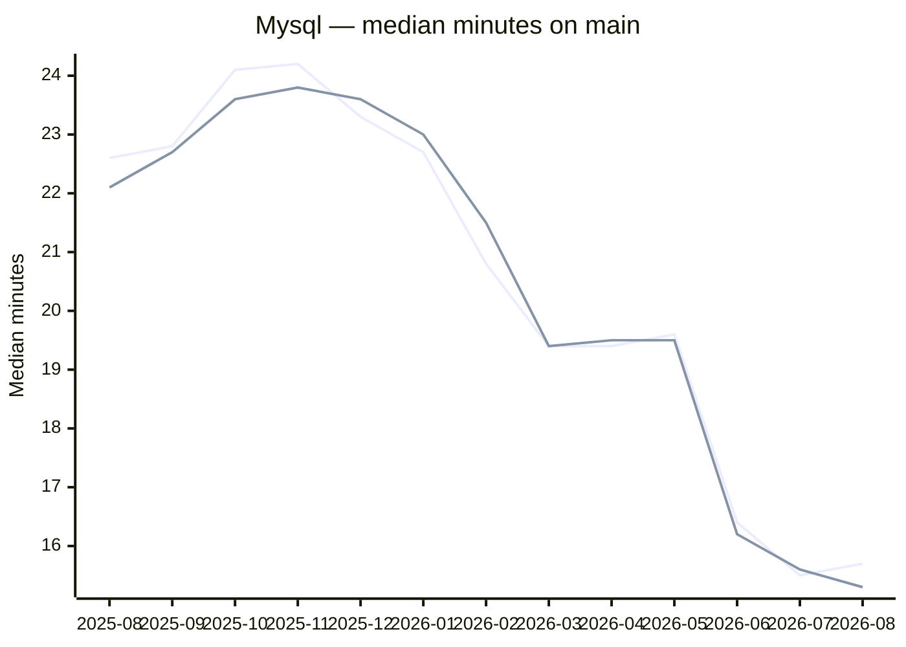
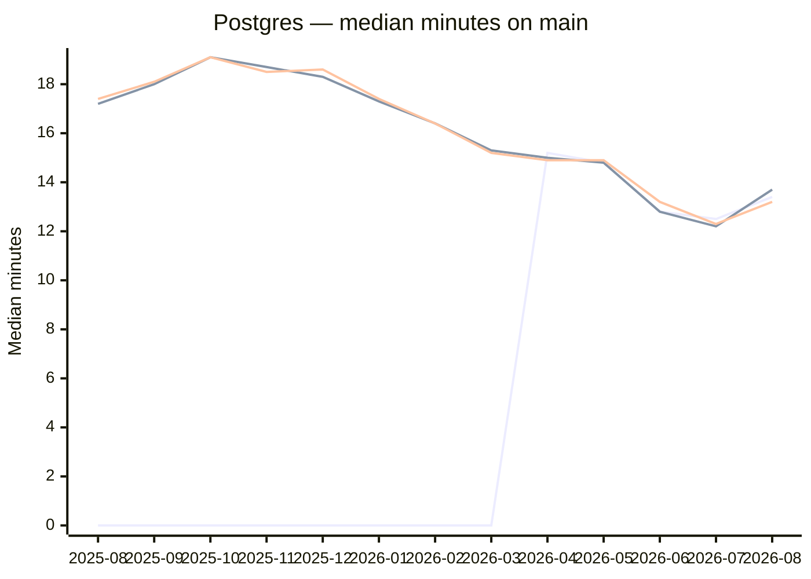

# Unit Tests — monthly median job duration (main)

Median (p50) wall-clock duration of each [`Unit Tests`](../../blob/main/.github/workflows/unit_tests.yml)
job on `main`, per month, split by database engine. Only jobs that **succeeded** count — a
failed or timed-out job's duration is meaningless. Duration includes DB-service start-up but
not queue time; it is comparable across months.

> Auto-generated by `.github/workflows/unit_test_duration_report.yml`. Each run upserts the
> completed months still in the API into `data/job_duration.csv`, preserving history past
> GitHub's ~400-day run retention. Do not edit this branch by hand.

## Mysql

## Postgres

## Data

| Month | Job | Runs | Median min |
|-------|-----|-----:|-----------:|
| 2025-08 | Rubocop | 31 | 2.9 |
| 2025-08 | Test-Mysql (mysql:5.7) | 22 | 16.9 |
| 2025-08 | Test-Mysql (mysql:8.0) | 31 | 22.6 |
| 2025-08 | Test-Mysql (mysql:8.2) | 31 | 22.1 |
| 2025-08 | Test-Postgres (postgres:13) | 31 | 18.2 |
| 2025-08 | Test-Postgres (postgres:15) | 31 | 17.2 |
| 2025-08 | Test-Postgres (postgres:17) | 31 | 17.4 |
| 2025-09 | Rubocop | 35 | 3.4 |
| 2025-09 | Test-Mysql (mysql:8.0) | 35 | 22.8 |
| 2025-09 | Test-Mysql (mysql:8.2) | 35 | 22.7 |
| 2025-09 | Test-Postgres (postgres:13) | 35 | 18.2 |
| 2025-09 | Test-Postgres (postgres:15) | 35 | 18.0 |
| 2025-09 | Test-Postgres (postgres:17) | 35 | 18.1 |
| 2025-10 | Rubocop | 36 | 3.7 |
| 2025-10 | Test-Mysql (mysql:8.0) | 36 | 24.1 |
| 2025-10 | Test-Mysql (mysql:8.2) | 36 | 23.6 |
| 2025-10 | Test-Postgres (postgres:13) | 36 | 19.2 |
| 2025-10 | Test-Postgres (postgres:15) | 36 | 19.1 |
| 2025-10 | Test-Postgres (postgres:17) | 36 | 19.1 |
| 2025-11 | Rubocop | 41 | 2.4 |
| 2025-11 | Test-Mysql (mysql:8.0) | 41 | 24.2 |
| 2025-11 | Test-Mysql (mysql:8.2) | 41 | 23.8 |
| 2025-11 | Test-Postgres (postgres:13) | 41 | 19.1 |
| 2025-11 | Test-Postgres (postgres:15) | 41 | 18.7 |
| 2025-11 | Test-Postgres (postgres:17) | 41 | 18.5 |
| 2025-12 | Rubocop | 31 | 2.4 |
| 2025-12 | Test-Mysql (mysql:8.0) | 31 | 23.3 |
| 2025-12 | Test-Mysql (mysql:8.2) | 31 | 23.6 |
| 2025-12 | Test-Postgres (postgres:13) | 31 | 19.1 |
| 2025-12 | Test-Postgres (postgres:15) | 31 | 18.3 |
| 2025-12 | Test-Postgres (postgres:17) | 31 | 18.6 |
| 2026-01 | Rubocop | 79 | 2.3 |
| 2026-01 | Test-Mysql (mysql:8.0) | 78 | 22.7 |
| 2026-01 | Test-Mysql (mysql:8.2) | 78 | 23.0 |
| 2026-01 | Test-Postgres (postgres:13) | 79 | 17.8 |
| 2026-01 | Test-Postgres (postgres:15) | 79 | 17.3 |
| 2026-01 | Test-Postgres (postgres:17) | 79 | 17.4 |
| 2026-02 | Rubocop | 59 | 2.4 |
| 2026-02 | Test-Mysql (mysql:8.0) | 60 | 20.8 |
| 2026-02 | Test-Mysql (mysql:8.2) | 60 | 21.5 |
| 2026-02 | Test-Postgres (postgres:13) | 60 | 17.5 |
| 2026-02 | Test-Postgres (postgres:15) | 60 | 16.4 |
| 2026-02 | Test-Postgres (postgres:17) | 60 | 16.4 |
| 2026-03 | Rubocop | 72 | 2.4 |
| 2026-03 | Test-Mysql (mysql:8.0) | 72 | 19.4 |
| 2026-03 | Test-Mysql (mysql:8.2) | 72 | 19.4 |
| 2026-03 | Test-Postgres (postgres:13) | 72 | 15.3 |
| 2026-03 | Test-Postgres (postgres:15) | 72 | 15.3 |
| 2026-03 | Test-Postgres (postgres:17) | 72 | 15.2 |
| 2026-04 | Rubocop | 76 | 2.4 |
| 2026-04 | Test-Mysql (mysql:8.0) | 76 | 19.4 |
| 2026-04 | Test-Mysql (mysql:8.2) | 76 | 19.5 |
| 2026-04 | Test-Postgres (postgres:13) | 35 | 15.4 |
| 2026-04 | Test-Postgres (postgres:14) | 41 | 15.2 |
| 2026-04 | Test-Postgres (postgres:15) | 76 | 15.0 |
| 2026-04 | Test-Postgres (postgres:17) | 76 | 14.9 |
| 2026-05 | Rubocop | 48 | 2.4 |
| 2026-05 | Test-Mysql (mysql:8.0) | 48 | 19.6 |
| 2026-05 | Test-Mysql (mysql:8.2) | 48 | 19.5 |
| 2026-05 | Test-Postgres (postgres:14) | 48 | 14.8 |
| 2026-05 | Test-Postgres (postgres:15) | 48 | 14.8 |
| 2026-05 | Test-Postgres (postgres:17) | 48 | 14.9 |
| 2026-06 | Rubocop | 68 | 2.4 |
| 2026-06 | Test-Mysql (mysql:8.0) | 68 | 16.4 |
| 2026-06 | Test-Mysql (mysql:8.2) | 68 | 16.2 |
| 2026-06 | Test-Postgres (postgres:14) | 68 | 12.8 |
| 2026-06 | Test-Postgres (postgres:15) | 68 | 12.8 |
| 2026-06 | Test-Postgres (postgres:17) | 68 | 13.2 |
| 2026-07 | Rubocop | 60 | 2.4 |
| 2026-07 | Test-Mysql (mysql:8.0) | 60 | 15.5 |
| 2026-07 | Test-Mysql (mysql:8.2) | 60 | 15.6 |
| 2026-07 | Test-Postgres (postgres:14) | 60 | 12.5 |
| 2026-07 | Test-Postgres (postgres:15) | 60 | 12.2 |
| 2026-07 | Test-Postgres (postgres:17) | 60 | 12.3 |
| 2026-08 | Rubocop | 51 | 2.3 |
| 2026-08 | Test-Mysql (mysql:8.0) | 51 | 15.7 |
| 2026-08 | Test-Mysql (mysql:8.2) | 51 | 15.3 |
| 2026-08 | Test-Postgres (postgres:14) | 51 | 13.4 |
| 2026-08 | Test-Postgres (postgres:15) | 51 | 13.7 |
| 2026-08 | Test-Postgres (postgres:17) | 51 | 13.2 |
