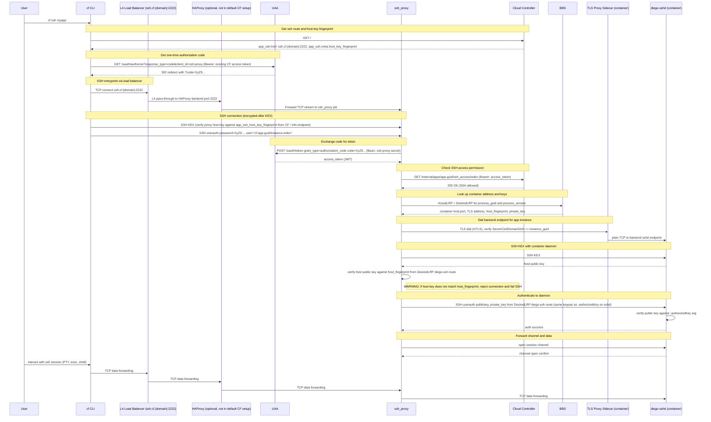

```mermaid
sequenceDiagram
participant User
participant cf as cf CLI
participant LB as L4 Load Balancer (ssh.cf.{domain}:2222)
participant HA as HAProxy (optional, not in default CF setup)
participant UAA
participant Proxy as ssh_proxy
participant CC as Cloud Controller
participant BBS
participant TLS as TLS Proxy Sidecar (container)
participant sshd as diego-sshd (container)

User->>cf: cf ssh myapp

Note over cf,CC: Get ssh route and host key fingerprint
cf->>CC: GET / 
CC-->>cf: app_ssh.href: ssh.cf.{domain}:2222, app_ssh.meta.host_key_fingerprint

Note over cf,UAA: Get one-time authorization code
cf->>UAA: GET /oauth/authorize?response_type=code&client_id=ssh-proxy (Bearer: existing CF access token)
UAA-->>cf: 302 redirect with ?code=XyZ9...

Note over cf,LB: SSH entrypoint via load balancer
cf->>LB: TCP connect ssh.cf.{domain}:2222
LB->>HA: L4 pass-through to HAProxy backend port 2222
HA->>Proxy: Forward TCP stream to ssh_proxy job

Note over cf,Proxy: SSH connection (encrypted after KEX)
cf->>Proxy: SSH KEX (verify proxy host key against app_ssh_host_key_fingerprint from CF / info endpoint)
cf->>Proxy: SSH userauth password=XyZ9..., user="cf:app-guid/instance-index"

Note over Proxy,UAA: Exchange code for token
Proxy->>UAA: POST /oauth/token grant_type=authorization_code code=XyZ9... (Basic: ssh-proxy:secret)
UAA-->>Proxy: access_token (JWT)

Note over Proxy,CC: Check SSH access permission
Proxy->>CC: GET /internal/apps/app-guid/ssh_access/index (Bearer: access_token)
CC-->>Proxy: 200 OK (SSH allowed)

Note over Proxy,BBS: Look up container address and keys
Proxy->>BBS: ActualLRP + DesiredLRP for process_guid and process_version
BBS-->>Proxy: container host:port, TLS address, host_fingerprint, private_key

Note over Proxy,TLS: Dial backend endpoint for app instance
Proxy->>TLS: TLS dial (mTLS), verify ServerCertDomainSAN == instance_guid
TLS->>sshd: plain TCP to backend sshd endpoint

Note over Proxy,sshd: SSH KEX with container daemon
Proxy->>sshd: SSH KEX
sshd-->>Proxy: host public key
Proxy->>Proxy: verify host public key against host_fingerprint from DesiredLRP diego-ssh route
Note right of Proxy: WARNING: if host key does not match host_fingerprint, reject connection and fail SSH

Note over Proxy,sshd: Authenticate to daemon
Proxy->>sshd: SSH userauth publickey, private_key from DesiredLRP diego-ssh route (same keypair as -authorizedKey on sshd)
sshd->>sshd: verify public key against -authorizedKey arg
sshd-->>Proxy: auth success

Note over Proxy,sshd: Forward channel and data
Proxy->>sshd: open session channel
sshd-->>Proxy: channel open confirm
User->>cf: interact with ssh session (PTY, exec, shell)
cf->>LB: TCP data forwarding
LB->>HA: TCP data forwarding
HA->>Proxy: TCP data forwarding
Proxy->>sshd: TCP data forwarding
```
